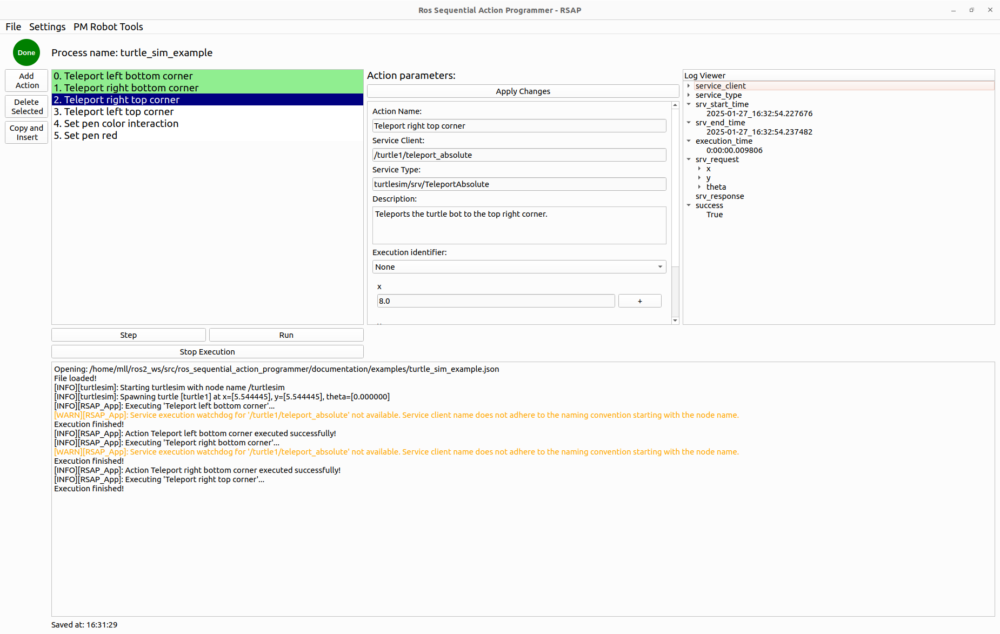

# ROS Sequential Action Programmer

*Disclaimer: This repository is in active development and still in an alpha version. Feel free to report bugs or contact me in case the application does not work for you.*

*It has only be tested on ROS2 Humble!*

## 1. Description & Concepts
The aim of the 'ros_sequential_action_programmer' (short RSAP) is to provide a convenient way for sequential execution of ROS2 service and action calls. 
With a GUI, the user can look for available service and action servers and append them to the sequence. 
Within the app, the call request can be parameterized conveniently. 
Figure 1 gives an overview of how the application looks.

  
*Figure 1: Overview of the RSAP GUI.*

Some important features:
* Loading and saving sequences to a JSON file.
* Logging of the sequence execution (this can be configured in the settings).
* Stepping through the sequence or executing the whole sequence.
* Convenient calling of ROS2 services.
* Convenient calling of ROS2 actions (this is currently only working on the 'action-support' branch but will be merged to main in the near future).
* Displaying logs from all the ROS2 nodes.

---

## 2. Installation
* To run the ros_sequential_action_programmer, the installation of ROS2 (tested on Humble) is mandatory.

* To start the ros_sequential_action_programmer, ensure you have the following packages/libraries installed:
```
pip3 install PyQt6
```
```
sudo apt install libxcb-cursor0
```
* Open a terminal in the 'src' folder of your ROS workspace and clone the repository.
* Build your workspace.
* Make sure to source your terminal to be able to use the ROS package.

## 3. Getting started (Tutorial)
To start the application, execute the launch file.
```
ros2 launch ros_sequential_action_programmer rsap_app.launch.py 
```
### 3.1 - Turtle bot
If you want to test the ros_sequential_action_programmer, you can experiment with the turtlesim example:
* First, launch a turtlesim robot.
```
ros2 run turtlesim turtlesim_node 
```
Start the RSAP by launching rsap_app.launch.py.
Open the example sequence by clicking on `File > Open Process` and navigating to `your_ros_workspace/src/ros_sequential_action_programmer/documentation/examples/turtle_sim_example.json`.
Start the sequence by clicking on Run (the sequence will execute very quickly).
You can add new ROS service calls by clicking on `Add Action > Services > Active Clients blk`.

### 3.2 - Using the API
tbd

## 4. To-Dos